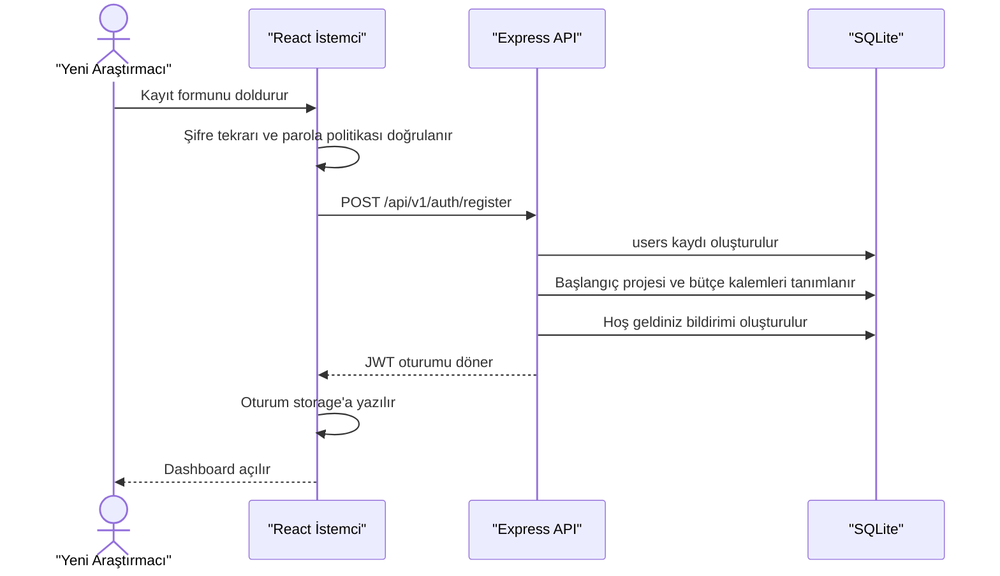
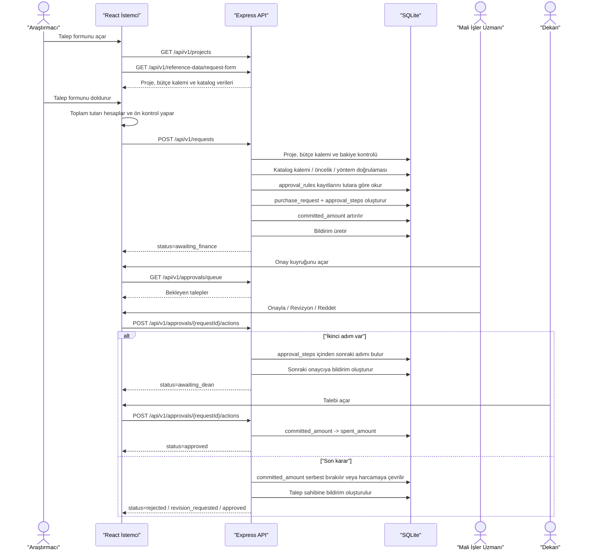

# ABDAYS Yazılım Tasarım Belgesi

## 1. Giriş

### 1.1 Amaç

Bu belge, ABDAYS (Akademik Bütçe ve Dinamik Onay Yönetim Sistemi) uygulamasının çalışan sürümü için yazılım tasarımını açıklar. Belge; React tabanlı kullanıcı arayüzünü, Express + SQLite tabanlı backend katmanını, JWT ile kimlik doğrulamayı, dinamik onay zincirini ve veritabanı güdümlü referans kataloglarını kapsar.

### 1.2 Kapsam

Sistem aşağıdaki işlevleri uçtan uca sağlar:

- Araştırmacı kaydı ve otomatik oturum açma
- Rol bazlı giriş (`Araştırmacı`, `Mali İşler Uzmanı`, `Dekan`)
- Dashboard, proje kartları ve bütçe görünürlüğü
- Satın alma talebinin taslak veya onaya gönderilmesi
- Bütçe bakiyesinin backend tarafında doğrulanması
- `approval_rules` tablosundan okunan dinamik onay zinciri
- Onay, red ve revizyon süreçleri
- Bildirim merkezi, okundu bilgisi ve dinamik gösterim stratejileri
- Sistem genelinde kullanıcı, proje ve kural yönetimi (Sistem Yöneticisi)
- Veritabanından gelen katalog, öncelik ve satın alma yöntemi listeleri

### 1.3 Tanımlar

- `ApprovalRule`: Talep tutarına göre hangi rolün hangi sırada onay vereceğini belirleyen tablo
- `Committed Amount`: Onay sürecinde bekleyen talepler için geçici olarak ayrılan bütçe
- `Spent Amount`: Nihai onaydan sonra harcanmış kabul edilen bütçe
- `Reference Data`: Talep formunda kullanılan bütçe kategorileri, katalog kalemleri, satın alma yöntemleri ve öncelikler

### 1.4 Çalışma Varsayımları

- Uygulama ilk çalıştırmada SQLite veritabanını otomatik oluşturur.
- İlk kurulumda sistem gerekli temel kullanıcıları, referans kataloglarını, onay kurallarını ve örnek operasyon verilerini otomatik üretir.
- Araştırmacı rolü arayüzden kayıt olabilir; onay rolleri kurumsal yönetim hesabı olarak sistemde hazır tutulur.

## 2. Referanslar

- ABDAYS SRS
- IEEE Std 1016-1998
- React
- Tailwind CSS
- Express
- SQLite
- TÜBİTAK proje bütçe tablolarında yer alan temel gider sınıfları
- İTÜ BAP başvuru ve harcama rehberlerinde yer alan belge ve harcama örüntüleri

## 3. Tasarım Kısıtları ve Kararlar

### 3.1 Teknoloji Yığını

- Frontend: React, React Router, Tailwind CSS, Axios, Recharts
- Backend: Node.js, Express
- Veri Tabanı: SQLite (`server/data/abdays.sqlite`)
- Kimlik Doğrulama: JWT
- Parola Hashleme: `bcryptjs`
- Dosya Yükleme: Multer

### 3.2 Kurulum Kararı

Proje tek klasörde tutulur. Kullanıcı yalnızca:

```bash
npm install
npm start
```

komutlarıyla sistemi ayağa kaldırır. `npm start` öncesinde frontend otomatik build edilir ve Express uygulaması aynı origin altında hem API’yi hem arayüzü servis eder.

### 3.3 İş Kuralı Kararları

- 10.000 TL altındaki talepler yalnızca `Mali İşler Uzmanı` onayına gider.
- 10.000 TL ve üzerindeki talepler önce `Mali İşler Uzmanı`, sonra `Dekan` onayına gider.
- Kural bilgisi kod içine gömülmez; `approval_rules` tablosundan okunur.
- Taslak talepler bütçe ayırmaz.
- Onaya gönderilen talepler ilgili bütçe kaleminde `committed_amount` olarak rezerve edilir.
- Red veya revizyon durumunda rezerve edilen tutar serbest bırakılır.
- Nihai onayda rezerve edilen tutar `spent_amount` alanına aktarılır.
- Şifre en az 8 karakter olmalı; büyük harf, küçük harf, rakam ve özel karakter içermelidir.
- Talep formundaki seçimli alanlar sabit dizi yerine veritabanındaki referans tablolardan beslenir.

### 3.4 SRS Hizalama Notları

- `FR-14`: Talep gönderildiğinde bakiye backend tarafında denetlenir ve yetersiz bakiye varsa işlem durdurulur.
- `FR-29` ve `FR-32`: Onay zinciri `approval_rules` tablosundan dinamik olarak okunur.
- `4.1 Kullanıcı Arayüzleri`: Arayüz mobil ve masaüstünde responsive davranır.

## 4. Mimari Görünümler

### 4.1 Sistem Bağlamı

```text
Kullanıcı
  -> React SPA
  -> Express API
  -> SQLite Veritabanı
  -> Yerel Dosya Deposu (yüklenen belgeler)
```

### 4.2 Composition Viewpoint

```text
ABDAYS
├── client (React SPA)
│   ├── AuthProvider
│   ├── Router
│   │   ├── LoginPage
│   │   ├── RegisterPage
│   │   └── ProtectedRoute
│   ├── AppShell
│   │   ├── Navbar
│   │   ├── NotificationsPopover
│   │   ├── Sidebar
│   │   └── Pages
│   │       ├── DashboardRouterPage
│   │       ├── ProjectsPage
│   │       ├── RequestNewPage
│   │       ├── RequestsPage
│   │       ├── ApprovalsPage
│   │       └── ReportsPage
│   ├── Components
│   │   ├── charts
│   │   ├── dashboard
│   │   ├── forms
│   │   ├── requests
│   │   └── shared
│   └── Services
│       ├── authService
│       ├── notificationService
│       ├── projectService
│       └── requestService
└── server (Express API)
    ├── config
    ├── database
    ├── middleware
    ├── routes
    │   ├── authRoutes
    │   ├── notificationRoutes
    │   ├── projectRoutes
    │   ├── requestRoutes
    │   └── approvalRoutes
    ├── services
    │   ├── userService
    │   ├── notificationService
    │   ├── projectService
    │   ├── requestService
    │   └── dashboardService
    └── utils
```

### 4.3 İstemci Bileşen Sorumlulukları

| Bileşen | Sorumluluk |
| --- | --- |
| `AuthProvider` | JWT oturumunu local/session storage içinde yönetir |
| `ProtectedRoute` | Oturum ve rol tabanlı erişim kontrolü yapar |
| `RegisterPage` | Araştırmacı kaydı, parola politikası gösterimi ve ilk oturum açma |
| `Navbar` | Kullanıcı özeti, bildirim merkezi ve oturum kapatma |
| `DashboardRouterPage` | Kullanıcı rolüne göre uygun dashboard ekranını seçer |
| `PurchaseRequestForm` | Talep oluşturma, düzenleme, toplam hesaplama, istemci ön kontrolü ve veritabanı kaynaklı seçim akışı |
| `RequestHistoryTable` | Araştırmacının tüm taleplerini ve düzenlenebilir kayıtları listeler |
| `ApprovalQueueTable` | Onaycıya bekleyen kayıtları ve karar alanını sunar |
| `BudgetStatusChart` | Bütçe kalemlerinin tahsis/harcama/kalan verilerini görselleştirir |
| `AdminDashboardPage` | Sistem genelindeki istatistikleri ve yönetim kısayollarını sunar |
| `AdminUsersPage` | Kullanıcı hesaplarını ve rollerini yönetir |
| `AdminProjectsPage` | Proje atamalarını ve bütçelerini yönetir |
| `AdminApprovalRulesPage` | Tutara dayalı onay kurallarını dinamik olarak yapılandırır |
| `ReportsPage` | Tüm roller için özet raporlar üretir |

### 4.4 Backend Modül Sorumlulukları

| Modül | Sorumluluk |
| --- | --- |
| `database.js` | Şema oluşturma ve ilk kurulum verilerini üretme |
| `userService` | Login, araştırmacı kaydı, parola doğrulama, token üretimi |
| `notificationService` | Bildirim oluşturma, okuma ve okunduya çekme |
| `projectService` | Proje erişimi, bütçe kalemi erişimi ve form referans verileri |
| `requestService` | Talep yaşam döngüsü, bütçe rezervasyonu, onay adımları, ek dosya işleme |
| `dashboardService` | Dashboard KPI ve grafik verileri |
| `authMiddleware` | JWT doğrulama ve rol kontrolü |

### 4.5 Veri Tasarımı

Ana tablolar:

- `users`
- `projects`
- `budget_categories`
- `budget_lines`
- `procurement_methods`
- `priorities`
- `item_catalog`
- `approval_rules`
- `purchase_requests`
- `approval_steps`
- `audit_logs`
- `notifications`

İlişkiler:

- Bir `user`, birden çok `project` sahibi olabilir.
- Bir `project`, birden çok `budget_line` içerir.
- Her `budget_line`, tek bir `budget_category` ile ilişkilidir.
- Her `item_catalog` kaydı, tek bir `budget_category` altında tanımlanır.
- Bir `purchase_request`, tek bir `project`, `budget_line`, `catalog_item`, `procurement_method` ve `priority` ile ilişkilidir.
- Bir `purchase_request`, birden çok `approval_step` ve `audit_log` kaydı üretir.
- Bir `user`, birden çok `notification` kaydı alabilir.

### 4.6 Veritabanı Şeması Özeti

```text
users (id, full_name, email, password_hash, role, department)
projects (id, owner_user_id, code, title, fund_source, total_budget, risk_level, start_date, end_date)
budget_categories (id, code, name, source_reference, required_documents)
budget_lines (id, project_id, budget_category_id, name, allocated_amount, spent_amount, committed_amount)
procurement_methods (id, name, description)
priorities (id, name, description, sla_days)
item_catalog (id, budget_category_id, name, unit, typical_unit_price, description)
approval_rules (id, min_amount, max_amount, step_order, approver_role, is_active)
purchase_requests (id, reference_no, project_id, budget_line_id, requester_id, item_name, budget_category_id, catalog_item_id, procurement_method_id, priority_id, unit, quantity, unit_price, total_amount, status, current_step_order, current_approver_role, last_comment)
approval_steps (id, request_id, step_order, approver_role, status, actor_user_id, comment, acted_at)
audit_logs (id, request_id, actor_user_id, action, note, created_at)
notifications (id, user_id, title, message, link, is_read, created_at)
```

## 5. Arayüz Tasarımı

### 5.1 Kimlik ve Onboarding

```text
LoginPage
  - E-posta
  - Şifre
  - Beni hatırla
  - Kayıt ekranına yönlendirme

RegisterPage
  - Ad soyad
  - Bölüm / birim
  - E-posta
  - Şifre
  - Şifre tekrarı
  - Parola politikası mesajı
  - Kayıt sonrası otomatik giriş
```

Rol kuralı:

- `Araştırmacı` hesabı arayüz üzerinden oluşturulabilir.
- `Mali İşler Uzmanı` ve `Dekan` hesapları güvenlik ve rol yönetimi sebebiyle ilk kurulum/yönetici tanımlı hesaplardır.
- Araştırmacı kaydı tamamlandığında kullanıcıya otomatik başlangıç projesi ve üç bütçe kalemi açılır.

### 5.2 Araştırmacı

```text
Navbar
Sidebar | Dashboard Header
Sidebar | KPI Kartları
Sidebar | Bütçe Grafiği + Talep Durum Grafiği
Sidebar | Proje Kartları
Sidebar | Son Talepler
```

Ek ekranlar:

- `Yeni Talep`: proje -> bütçe kalemi -> katalog kalemi akışına göre çalışan talep formu
- `Taleplerim`: taslak, revizyon, onaylı ve reddedilmiş tüm kayıtların listesi
- `Projelerim`: proje kartları ve bütçe detayları

### 5.3 Talep Formu Yerleşimi

```text
Sol kolon
  - Proje seçimi
  - Bütçe kalemi seçimi
  - Talep kalemi seçimi
  - Satın alma yöntemi
  - Öncelik
  - Birim, miktar, birim fiyat
  - Kısa açıklama
  - Gerekçe
  - Destek belgesi
  - Taslak / Onaya gönder aksiyonları

Sağ kolon
  - Canlı toplam tutar
  - Seçilen kalem bakiyesi
  - Öncelik ve SLA
  - Bakiye uygunluk durumu
  - Belge kontrol listesi
  - Seçili kategori kaynak notu
  - Seçili yöntem ve katalog açıklaması
```

### 5.4 Mali İşler Uzmanı

```text
Navbar
Sidebar | Dashboard Header
Sidebar | KPI Kartları
Sidebar | Onay Kuyruğu Tablosu
Sidebar | Talep Durum Grafiği
Sidebar | Bütçe Grafiği
```

Temel aksiyonlar:

- Talebi onaylama
- Revizyon isteme
- Talebi reddetme
- Karar notu yazma

### 5.5 Dekan

```text
Navbar
Sidebar | Dashboard Header
Sidebar | KPI Kartları
Sidebar | Onay Kuyruğu
Sidebar | Grafikler
```

Temel aksiyon:

- Mali İşler tarafından aktarılmış yüksek tutarlı talepler için nihai karar verme

### 5.6 Navigation Matrix

| Rota | Araştırmacı | Mali İşler Uzmanı | Dekan | Sistem Yöneticisi |
| --- | --- | --- | --- | --- |
| `/login` | Evet | Evet | Evet | Evet |
| `/register` | Evet | Hayır | Hayır | Hayır |
| `/dashboard` | Evet | Evet | Evet | Evet |
| `/projects` | Evet | Hayır | Hayır | Hayır |
| `/requests/new` | Evet | Hayır | Hayır | Hayır |
| `/requests` | Evet | Hayır | Hayır | Hayır |
| `/approvals` | Hayır | Evet | Evet | Hayır |
| `/reports` | Evet | Evet | Evet | Evet |
| `/admin/*` | Hayır | Hayır | Hayır | Evet |

## 6. Dinamik Akışlar

### 6.1 Kayıt Akışı



### 6.2 Talep ve Onay Akışı



## 7. API Sözleşmesi

### 7.1 Kimlik Doğrulama

#### 7.1.1 Araştırmacı Kaydı

`POST /api/v1/auth/register`

```json
{
  "fullName": "Elif Kaya",
  "department": "Bilgisayar Mühendisliği",
  "email": "elif.kaya@universite.edu.tr",
  "password": "GucluSifre123!"
}
```

Başarılı cevap:

```json
{
  "accessToken": "jwt-token",
  "refreshToken": "jwt-token",
  "expiresIn": 28800,
  "user": {
    "id": "generated-user-id",
    "fullName": "Elif Kaya",
    "email": "elif.kaya@universite.edu.tr",
    "role": "researcher",
    "department": "Bilgisayar Mühendisliği",
    "unreadNotificationsCount": 1
  }
}
```

#### 7.1.2 Giriş

`POST /api/v1/auth/login`

```json
{
  "email": "arastirmaci@abdays.edu.tr",
  "password": "Abdays2026!",
  "rememberMe": true
}
```

#### 7.1.3 Parola Politikası

`GET /api/v1/auth/password-policy`

```json
{
  "message": "Şifre en az 8 karakter olmalı; büyük harf, küçük harf, rakam ve özel karakter içermelidir."
}
```

### 7.2 Projeler

`GET /api/v1/projects`

```json
{
  "items": [
    {
      "id": "prj_101",
      "code": "ABD-101",
      "title": "Akıllı Araştırma Platformu",
      "fundSource": "TÜBİTAK 1001",
      "totalBudget": 240000,
      "remainingBudget": 149500,
      "riskLevel": "normal",
      "budgetLines": [
        {
          "id": "line_101_1",
          "name": "Teçhizat",
          "budgetCategoryId": "cat_equipment",
          "budgetCategoryName": "Makine ve Teçhizat",
          "allocatedAmount": 120000,
          "spentAmount": 32000,
          "committedAmount": 8500,
          "availableAmount": 79500,
          "requiredDocuments": [
            "Proforma fatura",
            "Teknik şartname",
            "Piyasa fiyat araştırması"
          ]
        }
      ]
    }
  ]
}
```

### 7.3 Talep Formu Referans Verisi

`GET /api/v1/reference-data/request-form`

```json
{
  "budgetCategories": [
    {
      "id": "cat_equipment",
      "code": "MKT",
      "name": "Makine ve Teçhizat",
      "sourceReference": "TÜBİTAK araştırma desteklerinde makine/teçhizat giderleri destek kalemleri arasında yer alır.",
      "requiredDocuments": [
        "Proforma fatura",
        "Teknik şartname",
        "Piyasa fiyat araştırması"
      ]
    }
  ],
  "procurementMethods": [
    {
      "id": "method_direct",
      "name": "Doğrudan temin",
      "description": "Teklif toplanarak doğrudan satın alma süreci yürütülür."
    }
  ],
  "priorities": [
    {
      "id": "priority_normal",
      "name": "Normal",
      "description": "Standart iş akışı içinde değerlendirilecek talepler içindir.",
      "slaDays": 10
    }
  ],
  "catalogItems": [
    {
      "id": "item_gpu",
      "budgetCategoryId": "cat_equipment",
      "name": "GPU hızlandırıcı kart",
      "unit": "adet",
      "typicalUnitPrice": 18500,
      "description": "Yoğun hesaplama ve model eğitimi için araştırma donanımı"
    }
  ]
}
```

### 7.4 Dashboard Özeti

`GET /api/v1/dashboard/summary`

```json
{
  "stats": [
    {
      "id": "remaining-budget",
      "label": "Kalan bütçe",
      "value": 149500,
      "format": "currency",
      "hint": "Projelerde kullanılabilir toplam bakiye"
    }
  ],
  "budgetChart": [
    {
      "id": "line_101_1",
      "name": "ABD-101 · Teçhizat",
      "allocatedAmount": 120000,
      "spentAmount": 32000,
      "committedAmount": 8500,
      "availableAmount": 79500
    }
  ],
  "statusChart": [
    {
      "id": "awaiting_finance",
      "name": "Mali İşler",
      "value": 1
    }
  ]
}
```

### 7.5 Talep Oluşturma / Güncelleme

`POST /api/v1/requests`

`PUT /api/v1/requests/:requestId`

Gönderim türü: `multipart/form-data`

Alanlar:

- `projectId`
- `budgetLineId`
- `catalogItemId`
- `procurementMethodId`
- `priorityId`
- `description`
- `quantity`
- `unitPrice`
- `justification`
- `action` (`draft` veya `submit`)
- `attachment` (opsiyonel dosya)

Başarılı cevap:

```json
{
  "id": "req_abc123",
  "referenceNo": "REQ-2026-0005",
  "budgetCategoryName": "Makine ve Teçhizat",
  "itemName": "GPU hızlandırıcı kart",
  "priorityName": "Normal",
  "status": "awaiting_finance",
  "currentApproverRole": "finance_specialist",
  "lastComment": "Talep onay sürecine gönderildi."
}
```

Hata örneği:

```json
{
  "message": "Bütçe kaleminde yeterli bakiye yok. Kullanılabilir tutar 79.500 TL."
}
```

### 7.6 Bildirimler

`GET /api/v1/notifications`

`POST /api/v1/notifications/read-all`

`POST /api/v1/notifications/:notificationId/read`

## 8. Güvenlik ve Kalite

### 8.1 Kimlik Doğrulama ve Yetkilendirme

- JWT access token frontend tarafında localStorage veya sessionStorage içinde tutulur.
- `ProtectedRoute` ile rota erişimi rol bazlı korunur.
- Backend tarafında `authenticate` ve `authorize` middleware’leri kullanılır.
- Mali İşler ve dekan onay ekranları rol doğrulaması olmadan açılamaz.

### 8.2 Parola Politikası

- Minimum 8 karakter
- En az bir büyük harf
- En az bir küçük harf
- En az bir rakam
- En az bir özel karakter
- Boşluk kabul edilmez

### 8.3 Doğrulama Katmanları

- Frontend: form alanları, zorunluluk kontrolleri, istemci tarafı bakiye ön kontrolü
- Backend: proje/bütçe kalemi uyuşması, katalog kalemi kategori doğrulaması, bakiye kontrolü, onay kuralı kontrolü

### 8.4 Erişilebilirlik ve Responsive Tasarım

WCAG 2.1 uyumu için:

- Yeterli renk kontrastı
- Semantik `button`, `table`, `textarea`, `select`, `label` kullanımı
- `aria-label` ve görünür etiketler
- Klavye ile erişilebilir aksiyon butonları
- Mobil ve masaüstü kırılımlarında uyumlu grid düzeni

## 9. Operasyonel Seed Verisi

### 9.1 İlk Kurulum Hesapları

- Sistem Yöneticisi: `admin@abdays.edu.tr`
- Araştırmacı: `arastirmaci@abdays.edu.tr`
- Mali İşler Uzmanı: `uzman@abdays.edu.tr`
- Dekan: `dekan@abdays.edu.tr`
- Şifre: `Abdays2026!`

### 9.2 Seed Edilen Referans Kategorileri

- Makine ve Teçhizat
- Sarf ve Tüketim Malzemesi
- Hizmet Alımı
- Seyahat
- Yazılım ve Lisans
- Kitap ve Yayın

### 9.3 Seed Edilen Satın Alma Yöntemleri

- Doğrudan temin
- Avanslı satın alma
- Hizmet sözleşmesi
- Seyahat harcama talebi

### 9.4 Seed Edilen Öncelikler

- Kritik
- Yüksek
- Normal
- Düşük

## 10. Çalıştırma ve Doğrulama

### 10.1 Çalıştırma

```bash
npm install
npm start
```

### 10.2 Geliştirme

```bash
npm run dev
```

### 10.3 Doğrulanan Senaryolar

- Araştırmacı kaydı ve otomatik giriş
- Güçlü parola zorunluluğu
- Bildirimlerin listelenmesi ve okunduya çekilmesi
- Proje -> bütçe kalemi -> katalog kalemi seçim zinciri
- Taslak talep oluşturma
- Taslağın onaya gönderilmesi
- Mali İşler kuyruğunda yeni kaydın görünmesi
- `npm run build` ile başarılı derleme

## 11. Yazılım Mühendisliği Prensipleri ve Uygulamaları

### 11.1 Clean Code Prensipleri

Yazılımın okunabilir, sürdürülebilir ve geliştirilebilir olması için projede aşağıdaki Clean Code prensipleri titizlikle uygulanmıştır:

- **Anlamlı İsimlendirme:** Değişken, fonksiyon ve dosya isimleri amaçlarını net bir şekilde ifade eder. Örneğin, `requestService.js` içindeki `applyApprovalAction` fonksiyonu, bir talebin onay/red/revizyon aksiyonlarını işlediğini açıkça belirtir.
- **Single Responsibility (Tek Sorumluluk):** Her bileşen ve fonksiyon tek bir işe odaklanır. React tarafındaki `StatusBadge` sadece durum gösterimi yaparken, `AuthMiddleware` sadece yetkilendirme kontrolü yapar.
- **DRY (Don't Repeat Yourself):** Kod tekrarından kaçınılmıştır. Veritabanı yardımcı fonksiyonları, tablo şemaları ve ortak UI bileşenleri merkezi modüllerde tanımlanarak her yerden erişilebilir kılınmıştır.
- **KISS (Keep It Simple, Stupid):** Onay akışı gibi karmaşık olabilecek mantıklar, veritabanı kuralları ve basit if-else yapılarıyla yönetilerek gereksiz karmaşıklıktan kaçınılmıştır.

### 11.2 Sistem Mimarileri

#### 11.2.1 Mimari Dezavantaj Analizi

1.  **Mikroservis Mimari:** Servisler arası iletişim gecikmeleri (network latency), dağıtık veri yönetimi zorlukları, karmaşık CI/CD süreçleri ve yüksek operasyonel maliyet en büyük dezavantajlarıdır.
2.  **Monolitik Mimari:** Uygulamanın bir kısmındaki hatanın tüm sistemi çökertme riski, büyük projelerde derleme sürelerinin uzaması ve teknolojik bağımlılıkların tüm sistemi kısıtlaması temel eksileridir.
3.  **Katmanlı Mimari:** Katmanlar arası gereksiz veri geçişleri (boilerplate code), performans kayıpları ve katmanlar arasındaki sınırların zamanla belirsizleşme riski dezavantaj oluşturabilir.

#### 11.2.2 Proje Seçimi ve Nedeni

ABDAYS projesinde **Katmanlı Monolitik Mimari** tercih edilmiştir.
- **Neden:** Projenin akademik ölçeği ve veri tutarlılığının (özellikle bütçe denetimi) kritik olması, tüm işlemlerin tek bir veritabanı (SQLite) üzerinden ACID prensiplerine uygun yönetilmesini gerektirmiştir. Ayrıca, tek komutla kurulum ve düşük kaynak tüketimi için monolitik yapı en verimli çözümdür.

### 11.3 UI (Kullanıcı Arayüzü) Mimarileri

#### 11.3.1 Kavramsal Açıklamalar

1.  **MVC (Model-View-Controller):** Veri, arayüz ve mantığın net bir şekilde ayrılmasıdır. Controller, Model ve View arasındaki trafiği yönetir.
2.  **MVP (Model-View-Presenter):** View tamamen pasiftir; Presenter, View'dan gelen olayları alıp Model'i günceller ve View'a ne göstereceğini söyler.
3.  **MVVM (Model-View-ViewModel):** View ve ViewModel arasında çift yönlü veri bağlama (data-binding) esastır. UI güncellemeleri otomatikleşir.
4.  **Component-Based Architecture:** Modern web geliştirmede esastır. Arayüzün, kendi durumunu (state) yöneten, bağımsız ve yeniden kullanılabilir parçalara bölünmesidir.

#### 11.3.2 Proje Uygulaması

ABDAYS'te **Component-Based Architecture (Bileşen Tabanlı Mimari)** kullanılmıştır.
- **Uygulama:** React bileşenleri (`ProjectCard`, `SectionCard`, `DashboardHeader`) bağımsız yapılar olarak tasarlanmıştır. Bu sayede bir bileşendeki değişiklik uygulamanın diğer kısımlarını bozmadan kolayca test edilebilir ve yeniden kullanılabilir hale getirilmiştir.

### 11.4 Tasarım Desenleri (Design Patterns)

#### 11.4.1 Önem ve Kavram

Tasarım desenleri, yazılım geliştirmede sık karşılaşılan sorunlara getirilen standart ve optimize edilmiş çözümlerdir. Kodun yeniden kullanılabilirliğini artırır, teknik borcu azaltır ve ekip içi iletişimi (ortak dil kullanımı) kolaylaştırır.

#### 11.4.2 Kategori ve Örnekler

- **Creational (Oluşturucu):** Nesne oluşturma sürecini soyutlayarak esneklik sağlar.
  - **Örnek: Singleton Pattern.**
  - **Uygulama:** `server/database.js` içindeki SQLite bağlantısı (`db`), uygulama genelinde tek bir örnek (instance) olarak ihraç edilir. Bu, aynı veritabanı dosyasına birden çok bağlantı açılmasını ve kaynak israfını önler.
- **Structural (Yapısal):** Nesnelerin ve sınıfların bir araya gelerek daha büyük yapıları nasıl oluşturacağını belirler.
  - **Örnek: Provider Pattern (Adapter/Proxy varyantı).**
  - **Uygulama:** `src/hooks/useAuth.jsx` içinde tanımlanan `AuthProvider`, kullanıcı yetkilendirme bilgisini tüm bileşen ağacına yapısal bir şekilde dağıtarak veri iletimini düzenler.
- **Behavioral (Davranışsal):** Nesneler arası iletişim ve algoritma sorumluluklarını düzenler.
  - **Örnek: Strategy Pattern.**
  - **Uygulama:** Onay süreci, talebin tutarına göre `approval_rules` tablosundan farklı "stratejiler" (onay adımları) seçerek çalışır. Kod, tutarın ne olduğunu bilmek yerine kurallar tablosundan gelen stratejiyi uygular.
  - **Örnek: Notification Rendering Strategy.**
  - **Uygulama:** `src/utils/notificationStrategies.jsx` içinde tanımlanan strateji yapısı, bildirim türüne (`info`, `success`, `warning`, `danger`) göre ikon ve renk paleti seçimi yapar. Bu sayede yeni bildirim türleri eklendiğinde UI bileşenlerini (`NotificationsPopover`) değiştirmek gerekmez.

### 11.5 Test Aşaması

#### 11.5.1 Test Teknikleri

- **Statik Test:** Kod çalıştırılmadan yapılan analizdir. Kod yazım hataları, stil uyumsuzlukları ve potansiyel mantık hataları bu aşamada yakalanır. Örn: ESLint, Prettier, Statik Tip Kontrolü (TypeScript).
- **Dinamik Test:** Kodun çalışma zamanında (runtime) fonksiyonel olarak test edilmesidir. Birimin (Unit), entegrasyonun (Integration) ve uçtan uca (E2E) akışların doğrulanmasını kapsar.

#### 11.5.2 Proje Uygulaması

- **Statik Test:** Projede `ESLint` kullanılarak kod yazım standartları denetlenmiş; `Prettier` ile kod formatı otomatikleştirilmiştir. Bu, kodun her geliştirici için aynı okunabilirlikte kalmasını sağlar.
- **Dinamik Test:** `npm start` sonrası manuel test senaryoları ile doğrulama yapılmıştır. Örneğin, "10.000 TL üzeri bir talep oluşturulduğunda sırasıyla Mali İşler ve Dekan rollerine bildirim gidiyor mu?" senaryosu, sistemin iş kurallarının çalışma zamanındaki doğruluğunu kanıtlar.
